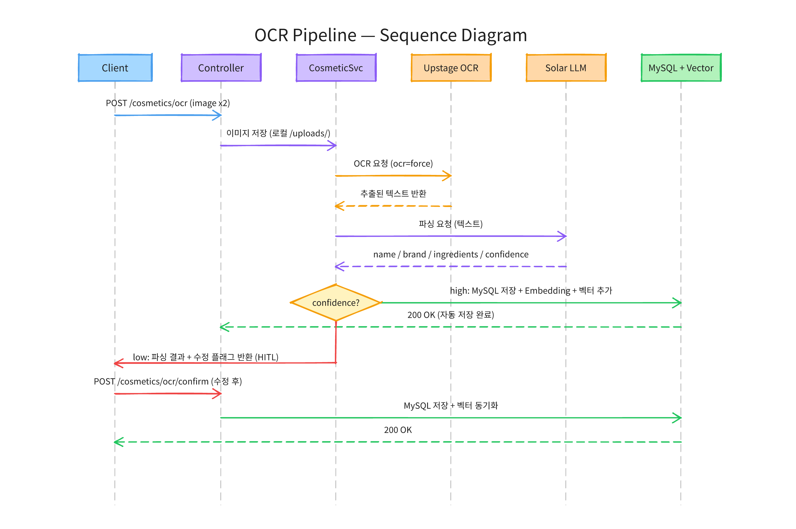
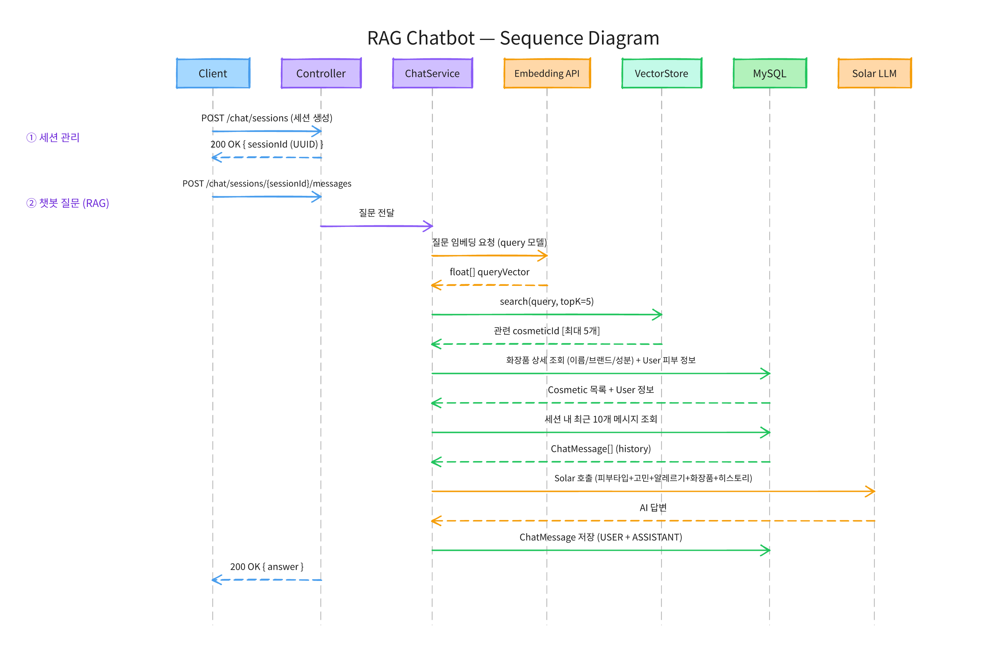
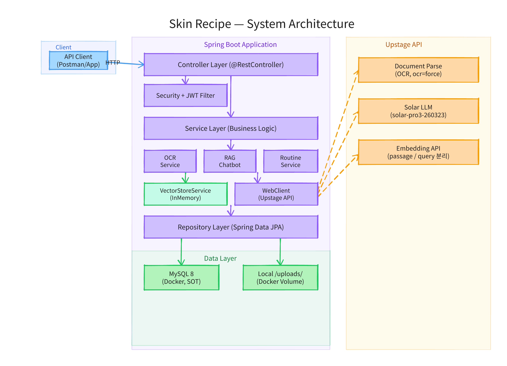
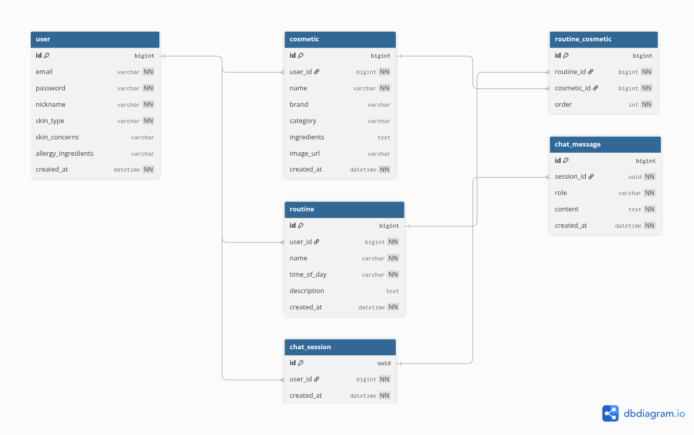

# (가) Skin Recipe

화장품 앱을 찾다 보면 전부 제품 탐색 플랫폼입니다. 화해도, 피꾸도 내가 가진 제품을 관리해주진 않아요.

이에 개인화된 기초 화장품 정보 제공 및 제품 사용법 추천 에이전트인 *Skin Recipe*를 선보입니다. 화장품 사진을 찍으면 OCR로 성분까지 자동 등록되고, 보유 화장품 기반으로 루틴을 추천하고 질문에 답해주는 개인 화장대 관리 서비스입니다.

## 동작 흐름

### OCR 등록 파이프라인



```
화장품 앞/뒤 사진 촬영
        ↓
Upstage Document Parse OCR → 성분표 텍스트 추출
        ↓
Solar LLM 파싱 → 제품명 / 브랜드 / 성분 / confidence(high/low)
        ↓
high → 자동 저장 + 벡터화
low  → 사용자 확인 후 저장 (HITL)
```

### RAG 챗봇 파이프라인



```
세션 생성 → 챗봇 질문 입력
                ↓
Upstage Embedding API → 질문 벡터화
                ↓
인메모리 벡터 검색 → 관련 화장품 5개 조회
                ↓
ChatService → 시스템 프롬프트 조립
              (피부타입 + 고민 + 알레르기 + 관련 화장품 성분)
                ↓
Solar LLM 호출 (세션 내 최근 10개 메시지 히스토리 포함)
                ↓
개인화된 답변 반환 + ChatMessage 저장
```

## 기술 스택

| 분류 | 기술 | 비고 |
|------|------|------|
| Language | Java 21 | |
| Framework | Spring Boot 3.5 | MVC, Security |
| ORM | Spring Data JPA | Repository 패턴 |
| DB | MySQL 8 | Docker (로컬) / RDS t4g.micro (프로덕션) |
| 인증 | Spring Security + JWT | jjwt 0.12 |
| 빌드 | Gradle | |
| OCR | Upstage Document Parse | ocr=force |
| LLM | Upstage Solar | solar-pro3-260323 |
| Embedding | Upstage Embedding API | solar-embedding-1-large-passage/query |
| Vector Store | InMemory (ConcurrentHashMap) | 전략 패턴, pgvector 확장 예정 |
| HTTP Client | WebClient | 비동기 외부 API 호출 |
| 이미지 저장 | 로컬 + Docker volume | OCR 로그 보관용 |
| Frontend | React + Vite | 순수 CSS, SPA |
| 프론트 배포 | Vercel | |
| 백엔드 배포 | AWS EC2 t2.micro | |

## 아키텍처



## 데이터 모델 (ERD)



## 아키텍처 핵심

**SOT 분리**
MySQL이 단일 진실 원천입니다. 인메모리 벡터는 검색 속도를 위한 사본이며 항상 MySQL 기준으로 동기화됩니다.

**VectorStoreService 전략 패턴**
```java
public interface VectorStoreService {
    void addVector(Long id, String text);
    void removeVector(Long id);
    List<Long> search(String query, int topK);
}
```
현재 `InMemoryVectorStoreService`가 `@Primary`입니다. 추후 `PgVectorStoreService`로 `@Primary`만 교체하면 마이그레이션 완료.

**RAG 개인화**
챗봇 system 프롬프트에 피부타입, 피부 고민, 알레르기 성분을 함께 주입해 별도 성분 DB 없이 개인화된 답변을 생성합니다.

## 실행 방법

```bash
# MySQL 실행
docker run -d --name mysql-cosmetic \
  -e MYSQL_ROOT_PASSWORD=1234 \
  -e MYSQL_DATABASE=mycosmetic \
  -p 3306:3306 \
  -v mysql-data:/var/lib/mysql \
  mysql:8

# 환경변수 설정
export UPSTAGE_API_KEY=your_api_key_here

# 서버 실행
./gradlew bootRun
```

## 배포

| 구성 요소 | 서비스 | 비고 |
|-----------|--------|------|
| 백엔드 | AWS EC2 t2.micro (서울) | GitHub Actions 자동 배포 |
| DB | AWS RDS t4g.micro MySQL 8 (서울) | EC2 내부망 전용 |
| 프론트엔드 | Vercel | main 브랜치 push 시 자동 배포 |

자세한 설정 절차는 [docs/deploy-guide.md](docs/deploy-guide.md) 참고.

## 개발 일정

| Phase | 주요 작업 | 상태 |
|:-----:|-----------|:----:|
| 1 | 프로젝트 세팅 + User 엔티티 + JWT 인증 | ✅ |
| 2 | Spring Security + Cosmetic CRUD + OCR 연동 | ✅ |
| 3 | HITL + Routine + VectorStoreService (InMemory) | ✅ |
| 4 | RAG 챗봇 (ChatSession + Embedding + Solar LLM) | ✅ |
| 5 | 중간 결산 — ERD + API 정의서 | ✅ |
| 6 | React 프론트엔드 개발 + 백엔드 연동 | ✅ |
| 7 | 배포 — EC2 + RDS + Vercel | ✅ |
| 8 | 인수 테스트 — 전체 사용자 흐름 검증 | 🔄 |
| 9 | 마무리 — 문서 작업 | ⬜ |

## 향후 개선 계획

### 기능 확장
- 인메모리 벡터 → pgvector 마이그레이션
- 이미지 저장 → S3 또는 외부 스토리지
- RAG 고도화 (Chunking, Reranking)
- 표준 성분 DB 연동
- 주간 루틴 고도화 — DayType(레티놀 데이, BHA 데이 등) 기반 요일별 루틴 분기 및 그래프 구조 관리

### 아키텍처
- `AuthService` → `AuthService` + `UserService` 분리 (SRP)
- 커스텀 예외 클래스 도입 (현재 `IllegalArgumentException` 직접 throw)
- 읽기 메서드 `@Transactional(readOnly = true)` 적용

### 알려진 이슈
- 선크림이 PM 루틴에 포함되는 경우 있음 (LLM 프롬프트 튜닝 필요)
- OCR 제품명 설명 텍스트 혼입, 브랜드 오인식, confidence 비결정적
- TC-C09: OCR 성분 추출 불완전으로 향료 포함 여부 RAG 검증 어려움
