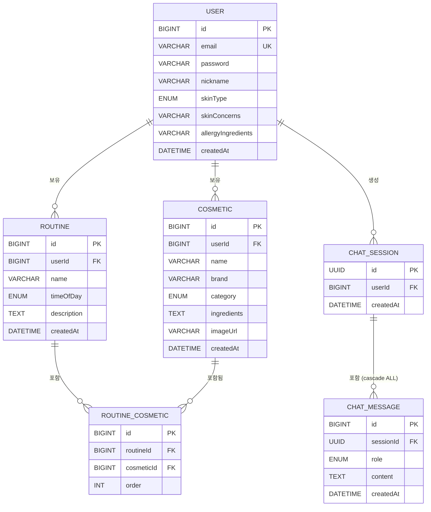

# Skin Recipe — ERD

## Mermaid (GitHub 렌더링용)



---

## 설계 노트

| 항목 | 내용 |
|------|------|
| **SOT** | MySQL이 단일 진실 원천. 인메모리 벡터 스토어는 Cosmetic 기반 사본이며 앱 기동 시 DB에서 재로드 |
| **UUID PK (ChatSession)** | 세션 ID 추측 불가 + 분산 환경 확장 고려 |
| **cascade ALL + orphanRemoval (ChatSession → ChatMessage)** | 세션 삭제 시 하위 메시지 자동 삭제 |
| **skinConcerns / allergyIngredients** | 정규화 없이 String 저장 (콤마 구분). RAG 프롬프트에 직접 주입해 LLM이 처리 |
| **Vector Store** | DB 테이블 없음. `ConcurrentHashMap<Long, float[]>` (cosmeticId → embedding). 전략 패턴으로 pgvector 교체 예정 |

---

## DBML (dbdiagram.io용)

```
Table user {
  id bigint [pk, increment]
  email varchar [unique, not null]
  password varchar [not null]
  nickname varchar [not null]
  skin_type varchar [not null, note: 'DRY / OILY / COMBINATION / SENSITIVE / NORMAL']
  skin_concerns varchar [note: '콤마 구분 문자열. 예: ACNE,MOISTURE']
  allergy_ingredients varchar [note: '자유 텍스트. 예: 향료, 알코올']
  created_at datetime [not null]
}

Table cosmetic {
  id bigint [pk, increment]
  user_id bigint [not null, ref: > user.id]
  name varchar [not null]
  brand varchar
  category varchar [note: 'SKIN / ESSENCE / CREAM / SUNSCREEN / CLEANSING / ETC']
  ingredients text
  image_url varchar
  created_at datetime [not null]
}

Table routine {
  id bigint [pk, increment]
  user_id bigint [not null, ref: > user.id]
  name varchar [not null]
  time_of_day varchar [not null, note: 'AM / PM']
  description text
  created_at datetime [not null]
}

Table routine_cosmetic {
  id bigint [pk, increment]
  routine_id bigint [not null, ref: > routine.id]
  cosmetic_id bigint [not null, ref: > cosmetic.id]
  order int [not null]
}

Table chat_session {
  id uuid [pk]
  user_id bigint [not null, ref: > user.id]
  created_at datetime [not null]
}

Table chat_message {
  id bigint [pk, increment]
  session_id uuid [not null, ref: > chat_session.id]
  role varchar [not null, note: 'USER / ASSISTANT']
  content text [not null]
  created_at datetime [not null]
}
```
